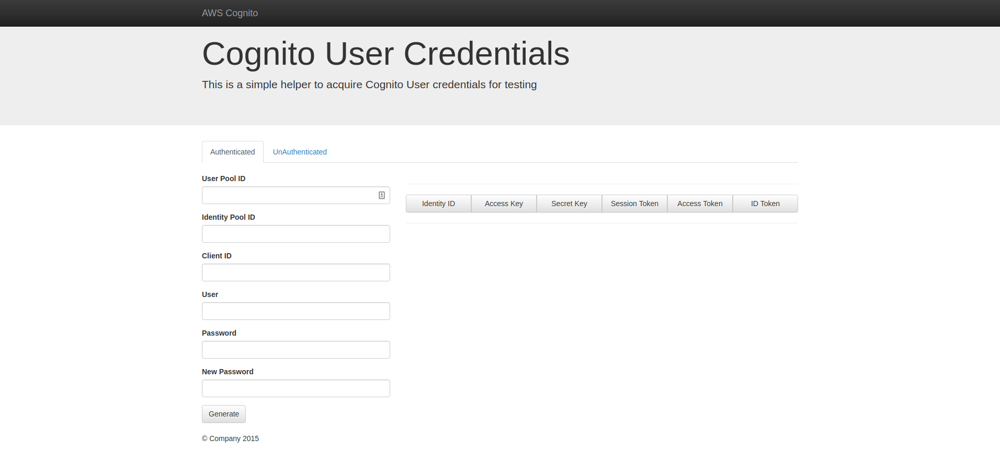
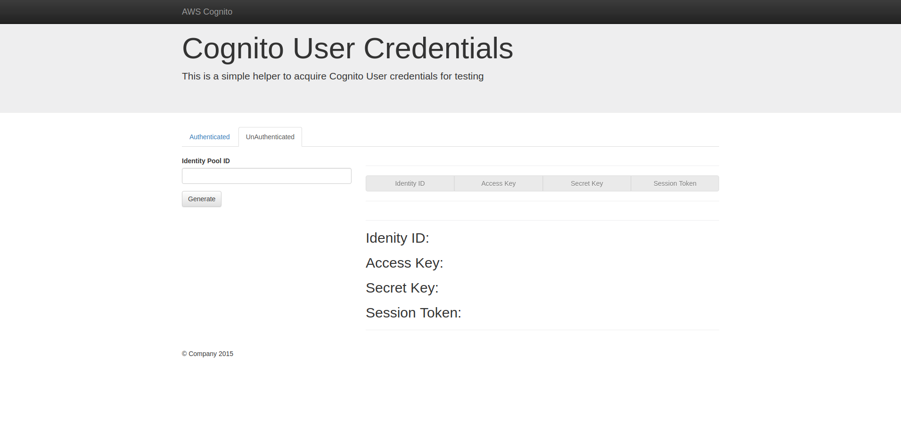

# AWS Cognito Credentials Helper

This is a simple helper to acquire Cognito User credentials for testing

## Installation

Clone the repository

```bash
git clone https://github.com/Saiyha240/aws-cognito-credentials-helper
```

Install packages with [NPM](https://www.npmjs.com/)
```bash
cd aws-cognito-credentials-helper
npm install
```
or

Install packages with [Yarn](https://yarnpkg.com/en/)
```bash
cd aws-cognito-credentials-helper
yarn install
```
## Usage

View `index.html` in the browser. No need for web servers and such.

### Authenticated crendentials

This is for logging in a user and procuring authenticated credentials

[]()

| Input | Description  | Example  | Notes  |
|---|---|---|---|
| User Pool ID  | Cognito user pool ID  | ap-northeast-1_xxxxxxxxx  |   |
| Identity Pool ID  | Cognito identity pool ID  | ap-northeast-1:xxxxxxxx-xxxx-xxxx-xxxx-xxxxxxxxx   |   |
| Client ID  | Cognito user pool client ID  | xxxxxxxxxxxxxxxxxxxxxxxxx  |   |
| User  | Cognito username  | bob  |   |
| Password  | Cognito password  | ****  |   |
| New Password  | Cognito new password  | ****  | Only use when Cognito user's status is FORCE_CHANGE_PASSWORD. This application will automatically update the user's password when you generate a token  |

### UnAuthenticated crendentials

This is for requesting unauthenticated credentials if your Identity Pool allows it

[]()

| Input | Description  | Example  | Notes  |
|---|---|---|---|
| Identity Pool ID  | Cognito identity pool ID  | ap-northeast-1:xxxxxxxx-xxxx-xxxx-xxxx-xxxxxxxxx   |   |

## Contributing
Pull requests are welcome. For major changes, please open an issue first to discuss what you would like to change.

## License
[MIT](https://choosealicense.com/licenses/mit/)